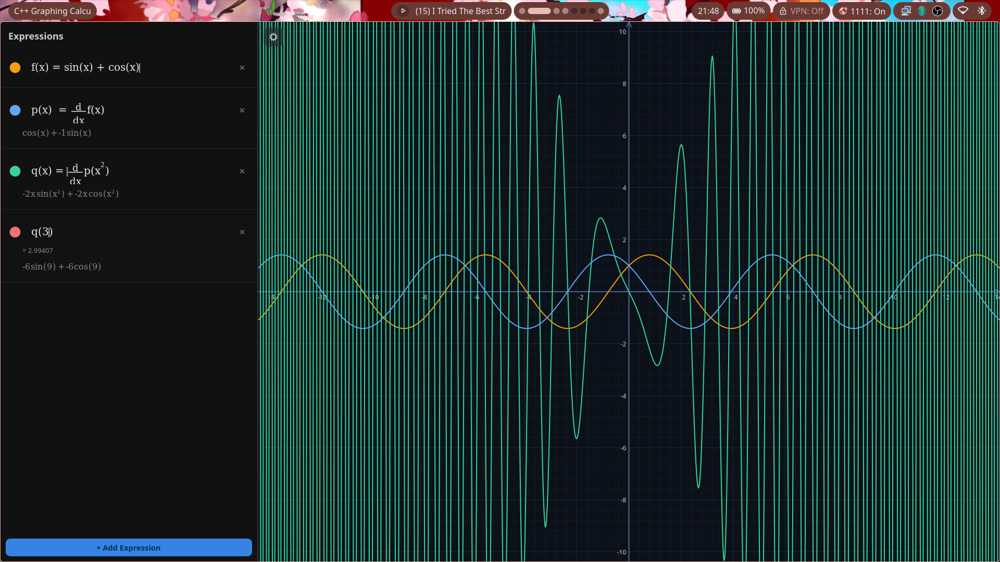
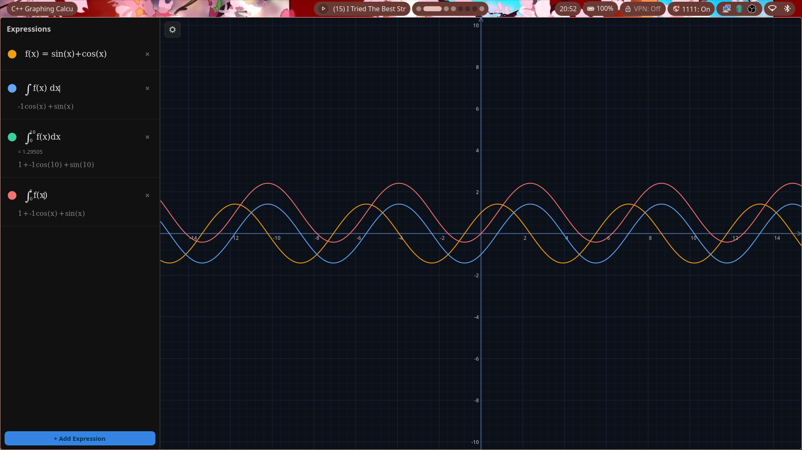
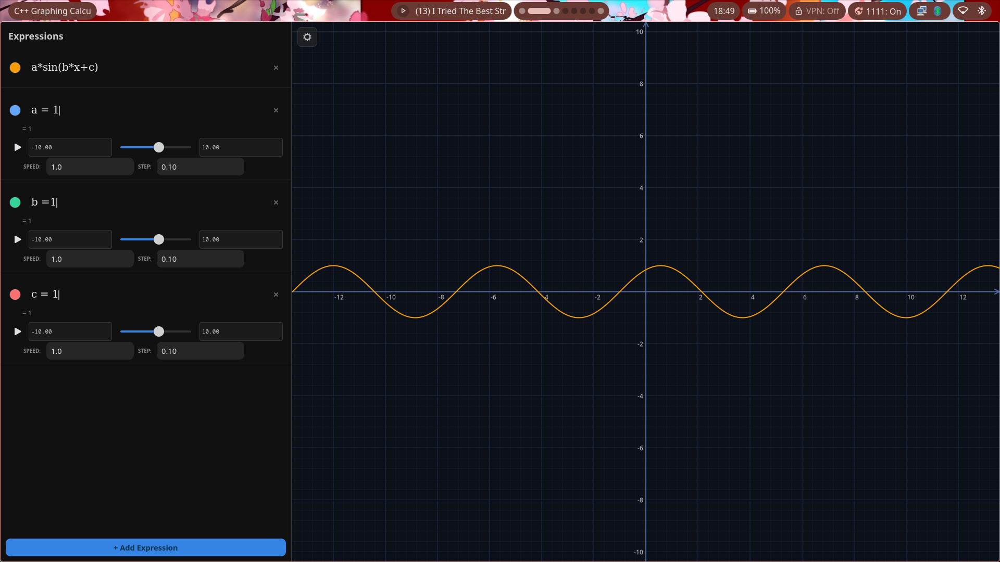

# LaTeX Calculator - Graphing & Visualization Subsystem

A high-performance, symbolic graphing engine built with **C++**, **GTK4**, and **Cairo**.

---

## � Interface Preview


*Figure 1: High-fidelity math rendering and live symbolic derivative evaluation.*

---

## 🏗️ Architecture & Core Components

The system is designed with a strict separation between the symbolic algebra engine and the hardware-accelerated rendering pipeline.

### 1. Symbolic Engine (`src/`)
* **AST & Operations**: `ast.hpp` and `ast_ext.hpp` form the backbone, handling symbolic representation, expansion (`expand()`), and simplification (`simplify()`).
* **Deep Integration**: `integrator.cpp` performs symbolic integration using rules like substitution and parts.
* **Algebraic Context**: `evaluator.hpp` and `function_registry.hpp` manage variables and user-defined functions with support for symbolic expansion.

### 2. High-Performance UI
* **Custom Widgets**: `math_editor.cpp` provides a "What You See Is What You Get" (WYSIWYG) LaTeX editor widget with dynamic height adjustment and rich symbol support.
* **Vector Graphics**: `renderer.hpp` uses Cairo for crisp, sub-pixel accurate rendering of complex math notation.
* **Interactive Canvas**: `plotter.hpp` handles the coordinate transformations, adaptive grid lines, and smooth function plotting.

---

## 🎥 Functionality Demonstrations

### Polar Plotting & Animations
The engine supports complex polar equations ($r = f(\theta)$) with high-resolution sampling.


*Demo: Real-time rendering of polar roses and parametric curves.*

### Live Symbolic Results
As you type in the sidebar, the system automatically expands and simplifies expressions. Defining functions like $f(x) = \sin(x)$ allows for immediate symbolic usage in other expressions.


*Figure 2: Function registry in action, evaluating integrals and user-defined functions simultaneously.*

---

## 🛠️ Usage Guide

### Canvas Interaction
| Action | Control |
| :--- | :--- |
| **Pan** | Left-Click + Drag |
| **Zoom** | Mouse Scroll (at cursor) |
| **Focus** | Click an equation to highlight its plot |

### Variable Sliders
When you define a constant (e.g., `a = 1.5`), an interactive slider is automatically generated in the sidebar. Dragging this slider updates all dependent graphs in real-time at 60 FPS.


*Figure 3: Dynamic constant adjustment via auto-generated UI sliders.*

---

## 🚀 Compilation & Build Instructions

Ensure you have the development headers for **GTK4** and **Cairo**.

### Arch Linux
```bash
sudo pacman -S gtk4 cairo base-devel
make viewer && ./viewer
```

### Ubuntu / Debian
```bash
sudo apt install build-essential libgtk-4-dev libcairo2-dev
make viewer && ./viewer
```

### Windows (MSYS2 UCRT64)
```bash
pacman -S mingw-w64-ucrt-x86_64-gcc mingw-w64-ucrt-x86_64-gtk4 mingw-w64-ucrt-x86_64-pkg-config make
make viewer && ./viewer.exe
```

---
